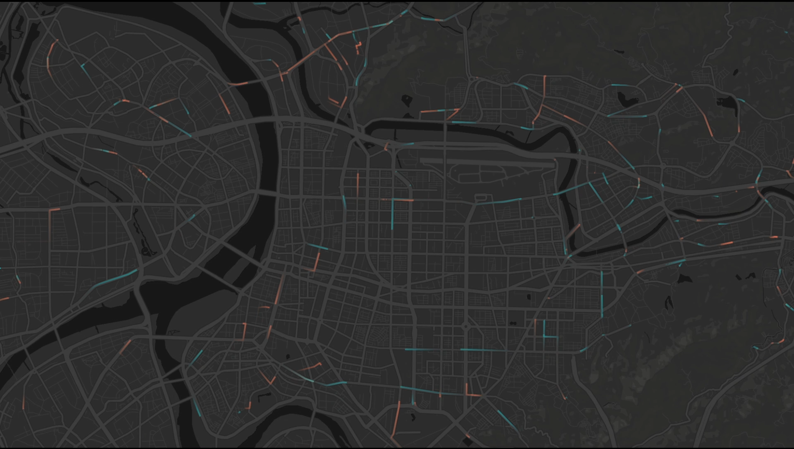
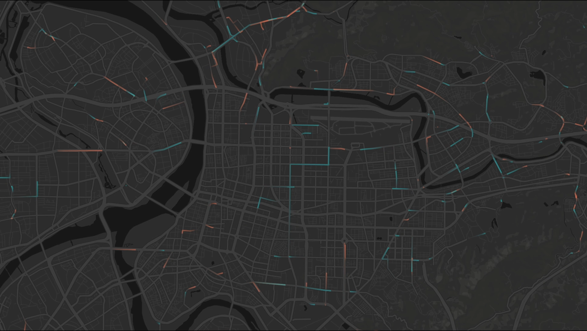

# Overview
I have always been curious about ***what its look like of this data?*** So this time I decided to use [deck.gl](https://deck.gl/#/) to take a look. And this is the a data visualization of taipei bus data.

<https://www.youtube.com/watch?v=lFcz2MvXOzo>

Source data: <https://gist.motc.gov.tw/>

# How I implement This
I have no clue how to use deck.gl, so I follow the steps on [Getting Started](https://deck.gl/#/documentation/getting-started/installation) in its document.  

After you successfully build and see the first example, you can dive in to other directories in `examples/website` basically just `npm install` and `npm start` to see all of them.  

This repository is adapted from `trips`.  

I think the hard part is to think of what data do I wanted to visualize. Here are some place to get inspiration.  
	
	1. https://ptx.transportdata.tw/PTX/
	2. https://data.taipei/#/
	3. https://data.gov.tw/
	4. Just google XXX open data

# Install
Check out the [Getting Started](https://deck.gl/#/documentation/getting-started/installation) in deck.gl. Do not forget to set the environment variable of mapbox token.

